# Face-Recognition-

In this we have used the Transfer Learning for training the model and recognition the faces.

## TASK

To create a model which detect the face or make a face detection model using the transfer learning

### We have used the MobileNet to train the model with our images

### Step 1: We have import the pretrained model or load the mobilenet model

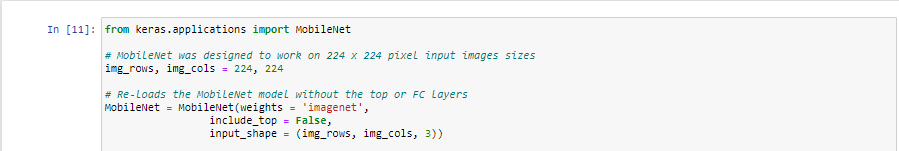

### Step 2: Freeze all layers of the model expext the last layers as we have to make changes in that layer

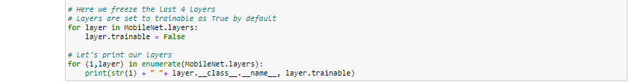

### Step 3: Make a function that return the FC Head. This is the layer creation to train our model

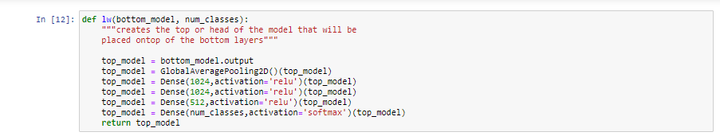

### Step 4: Now add the layer which we have created to the MobileNet layers where we have freezed all the layers

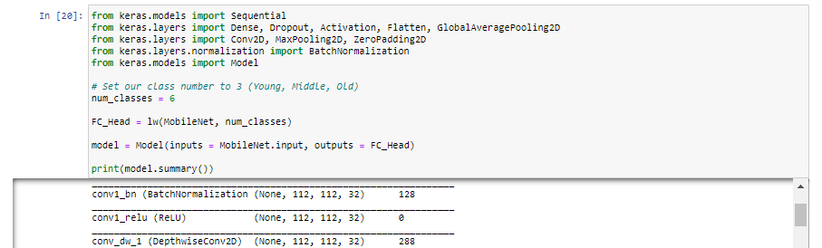

### Step 5: Now load the dataset which you have to train and this should be in the folder and the output depends on the folder name

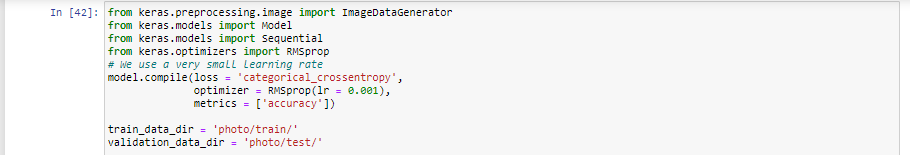

### Step 6: Now compile the model and we have use imagedatagenerator to generate our images for the training

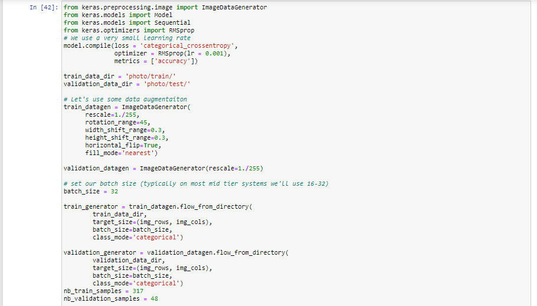

### Step 7: Now finally train the model and after the epochs completed then save that model

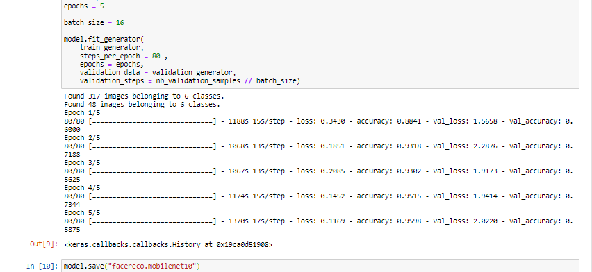

### Step 8: Now load the saved model to test our model.

### Step 9: Test our model with the testing images we have putted in the folder. Here we have made a small python programm to do so and used cv2 module to show the images.

* Here the python program is using the random photo from the test folder for testing.

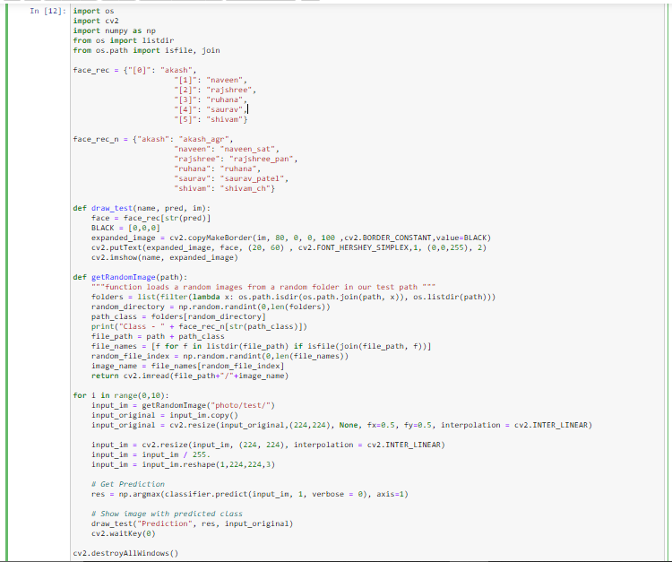

### Outputs:

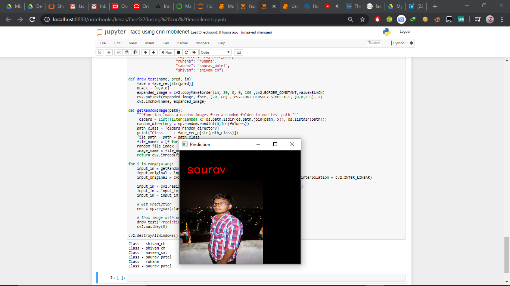

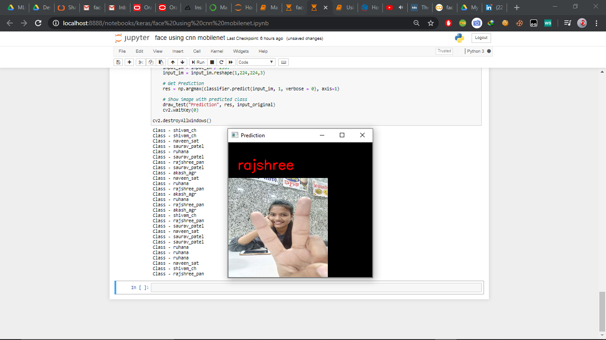

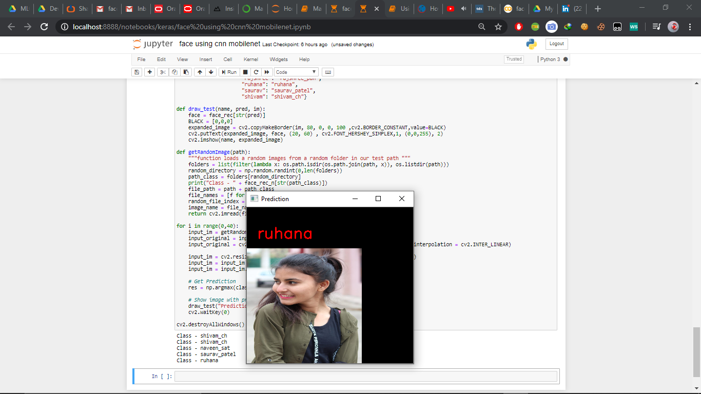

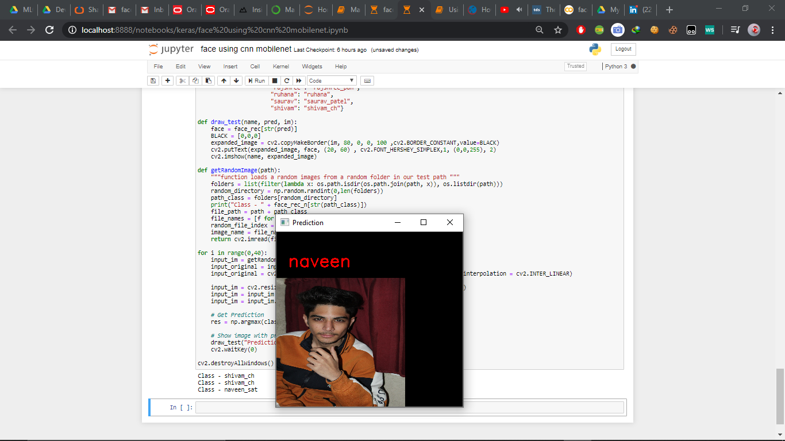

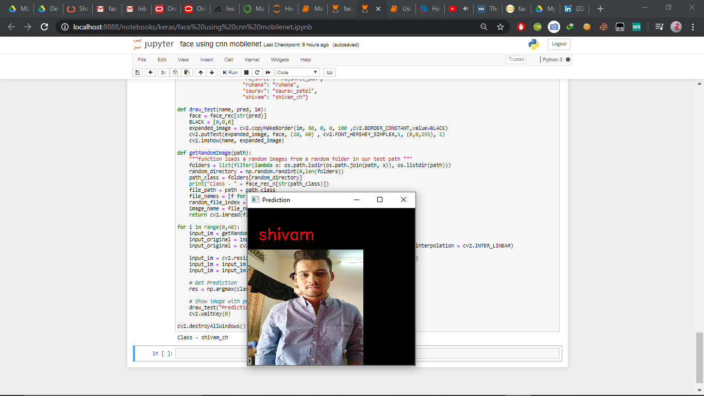

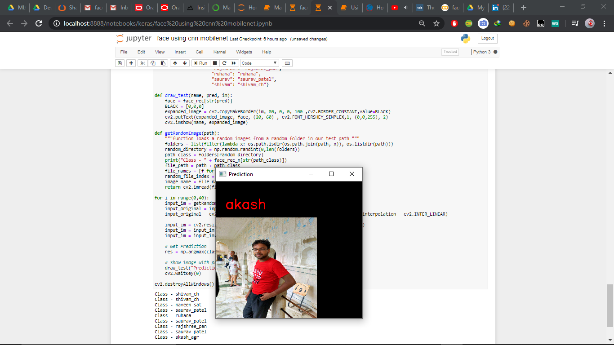

## Author

[SAURAV PATEL](https://www.linkedin.com/in/saurav-patel-148539151/)
